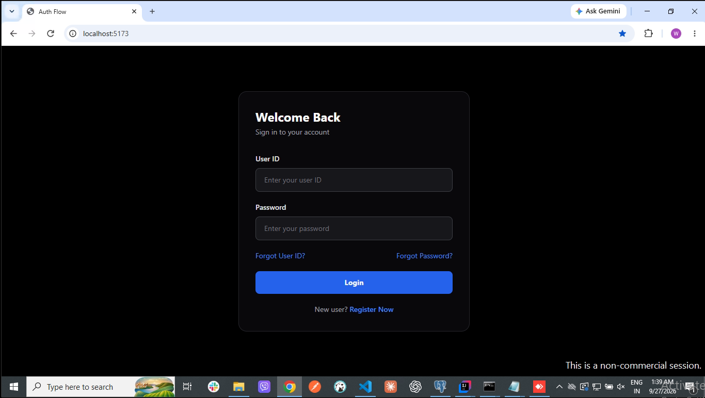
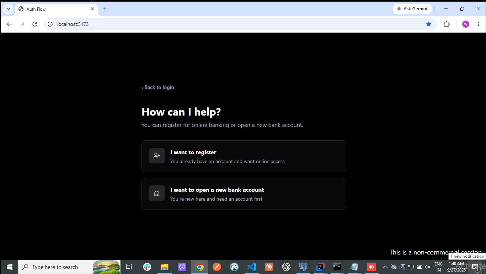
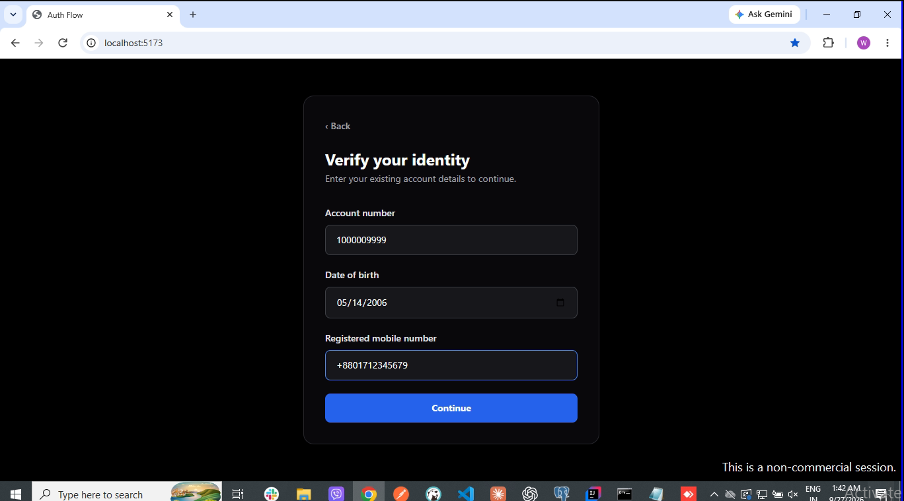
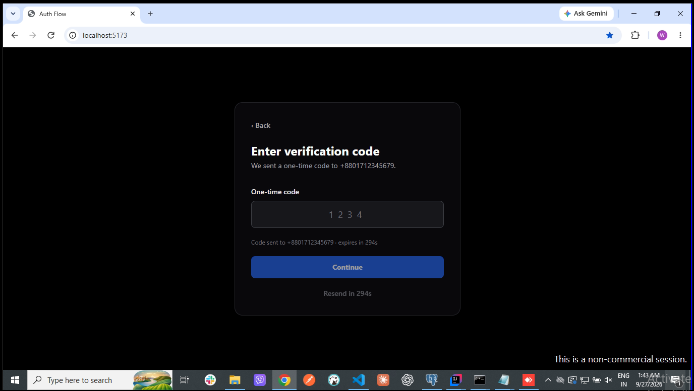
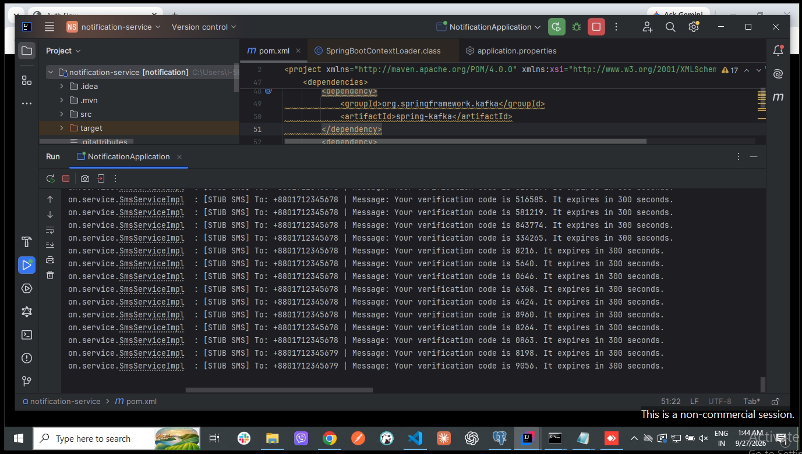
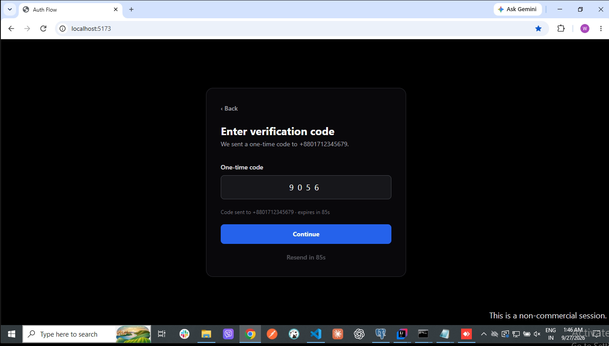
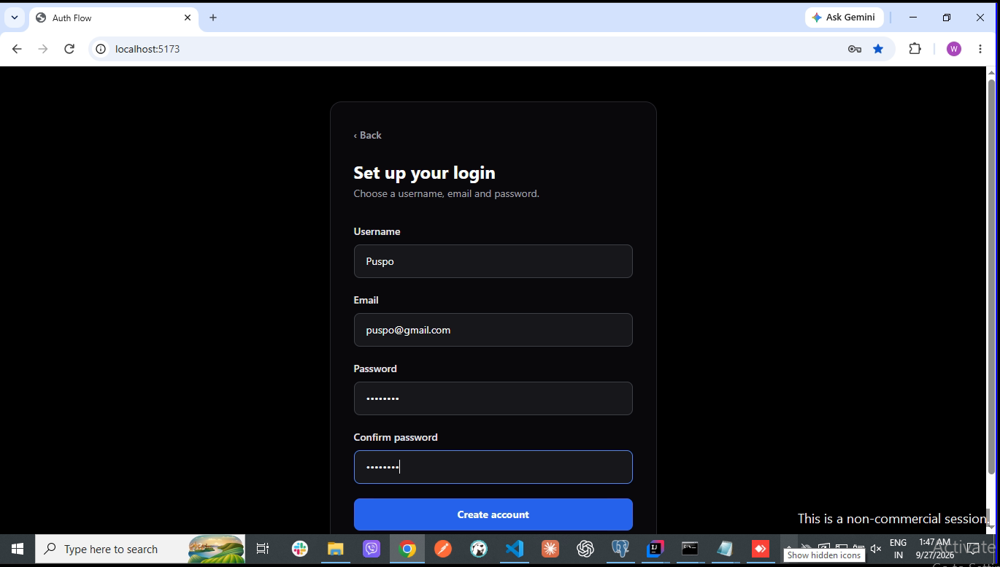
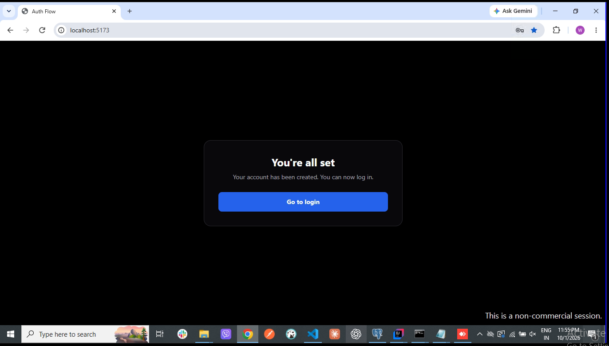
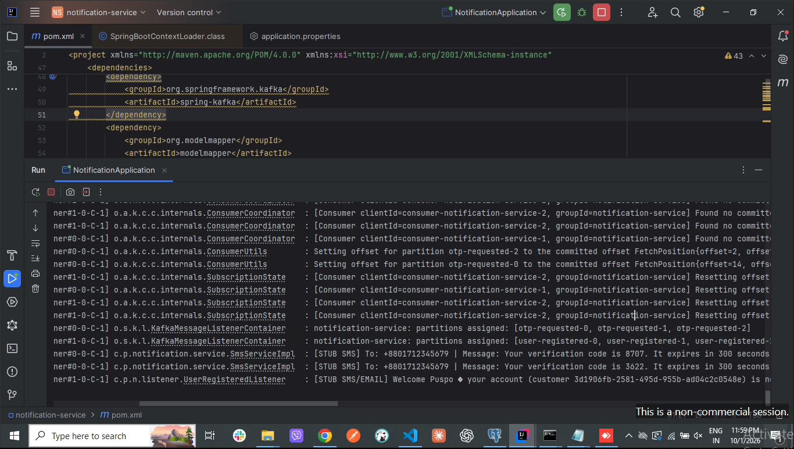

# Bank Management System — Spring Webflux, Microservices, GraphQL, gRPC, Kafka 

## A Bank Management System built on Spring Webflux, Microservices, GraphQL, gRPC, Kafka (Work-in-progress)

Tools & Technology:
 - Java 23, Spring Boot 3.5 (Spring WebFlux — reactive, non-blocking)
 - Spring Data R2DBC + PostgreSQL (isolated database per service)
 - GraphQL via Netflix DGS (auth-service)
 - gRPC + Protocol Buffers (internal service-to-service calls)
 - Apache Kafka (planned — Saga/Outbox pattern for transfers)
 - Kong API Gateway (planned)
 - Docker Compose (planned — local orchestration)
- React + TypeScript + Tailwind CSS (frontend)

Completed Features:
 - User registration (auth-service)
 - Identity verification via account number lookup (auth-service → account-service)
 - Identity match on date of birth and mobile number (auth-service → customer-service)
 - OTP generation, delivery (via SMS), and verification for identity confirmation (auth-service ↔ notification-service, Redis + Kafka outbox)
 - Credential setup & account activation — creates username/password linked to verified customer, with welcome notification (auth-service → notification-service)

